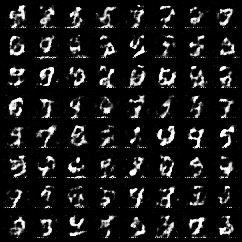
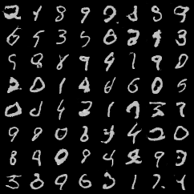
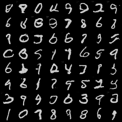

# 🧠 GAN Project: Handwritten Digit Generation

Welcome to my GAN (Generative Adversarial Network) project built using PyTorch. The model is trained to generate images of handwritten digits like MNIST!

---

## 📌 Overview

- **🎨 Generator**: Takes noise and generates images.
- **🕵️ Discriminator**: Tries to distinguish real images from fake ones.
- The two networks are trained in a **competitive zero-sum game** until the generator produces realistic digits.

---

## ⚠️ Challenge Faced: Loss Imbalance

During training, I observed:

- ❌ Generator Loss kept **increasing**
- ✅ Discriminator Loss **decreased to nearly zero**

### 😵 Why Did This Happen?

This happened because the **Discriminator learned much faster** than the Generator. Once the Discriminator became too confident, it started rejecting almost everything the Generator created — even when those outputs improved.  
This led to **vanishing gradients** for the Generator, making it difficult for it to learn anything meaningful.

---

## 🛠️ Solution

To restore the balance:

- 🔼 Increased **Generator's Learning Rate**  
- 🔽 Decreased **Discriminator's Learning Rate**

This helped the Generator **catch up** during training, allowing both networks to improve together. It led to a more stable GAN and much better image quality over time!

---

## 🖼️ Generated Images Over Epochs

Here's a glimpse of how the Generator improved:

### 📉 Epoch 1

### 📈 Epoch 35

### 🌟 Epoch 50

---

## 📚 Key Takeaways

- Balancing GAN training is **critical**.
- Learning rate tuning can **dramatically** affect performance.
- GANs are sensitive to training dynamics — keep an eye on losses! 🔍

---

👨‍💻 Built with ❤️ using PyTorch
